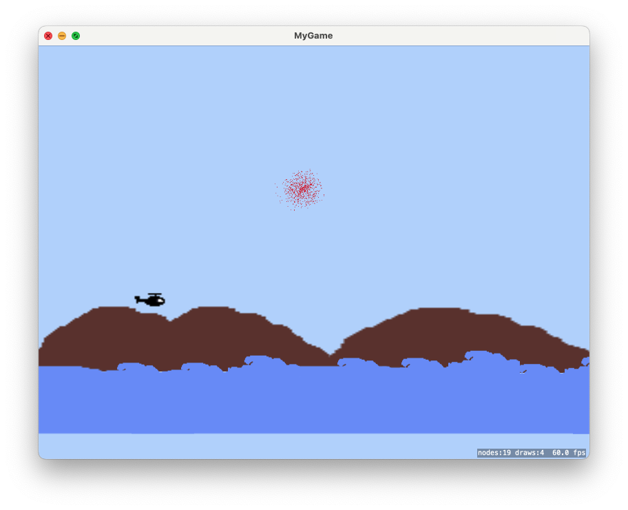

# 2D macOS Game with SpriteKit

A simple 2D game for macOS built using **SpriteKit** and **Swift**.

SpriteKit is Apple’s native 2D game framework, offering high-level APIs for graphics, animation, and physics simulation.

- Written in **Swift**
- Uses **SpriteKit** for rendering, animation, and physics
- Designed for **macOS**

### Other information

- **macOS 15.5** or later
- **Xcode 16.4**

